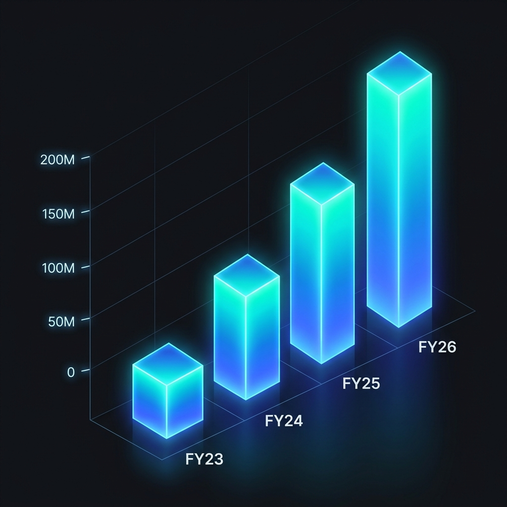
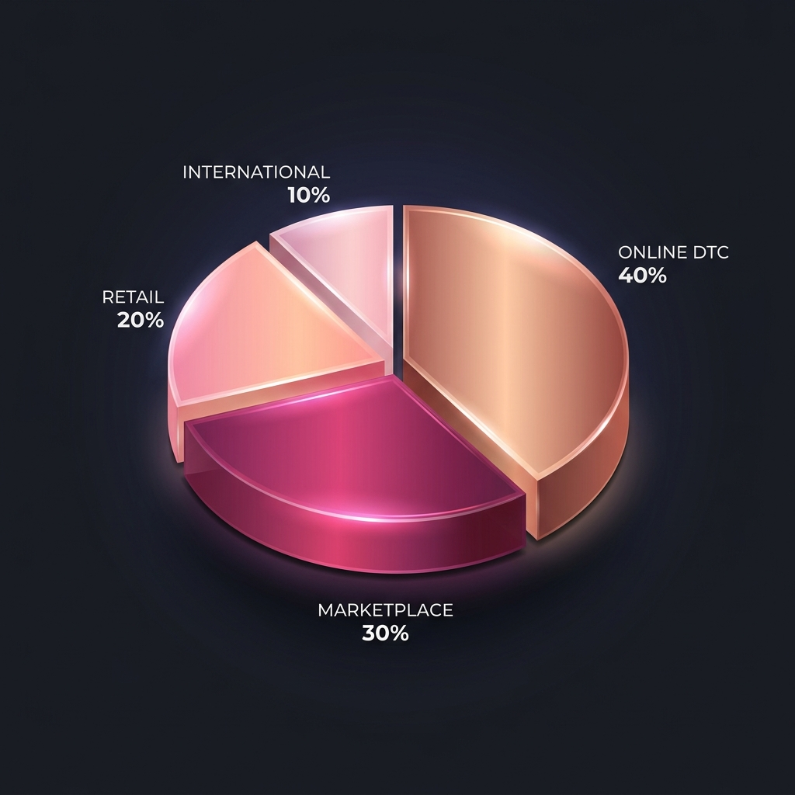
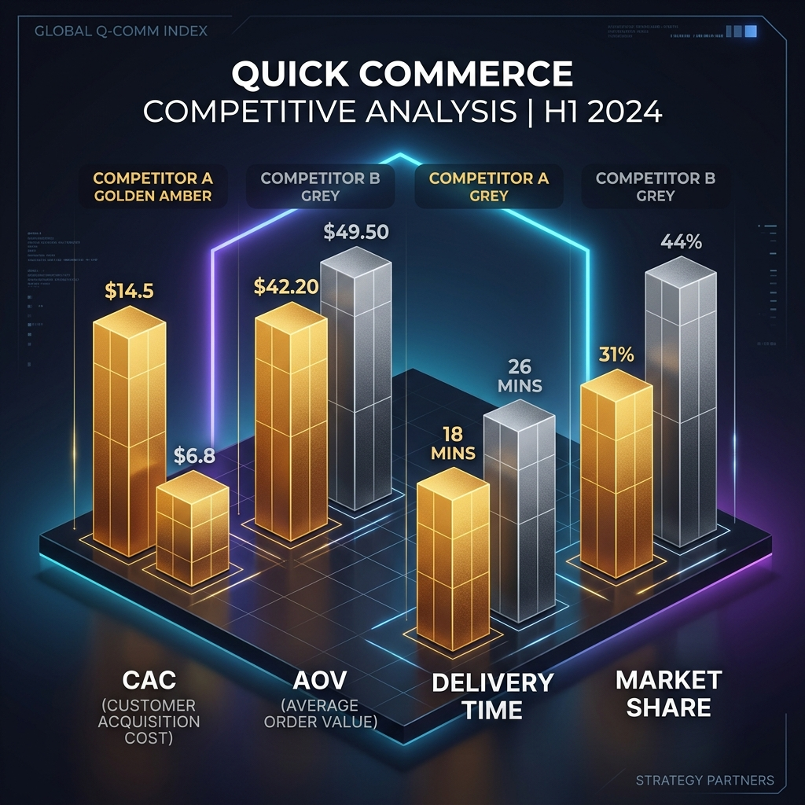
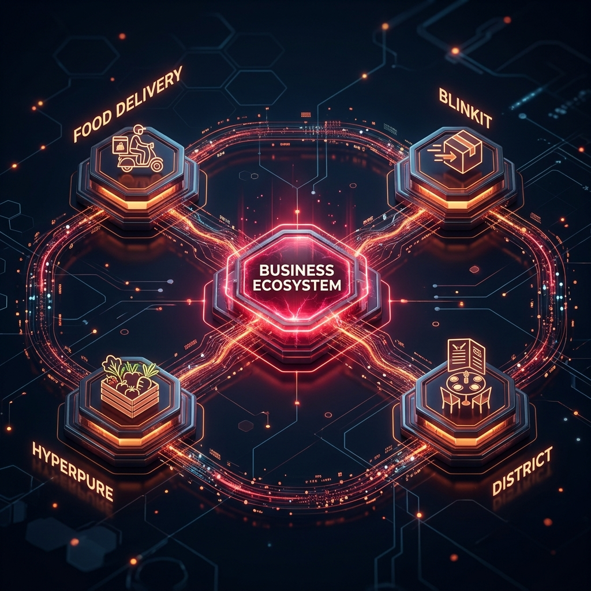
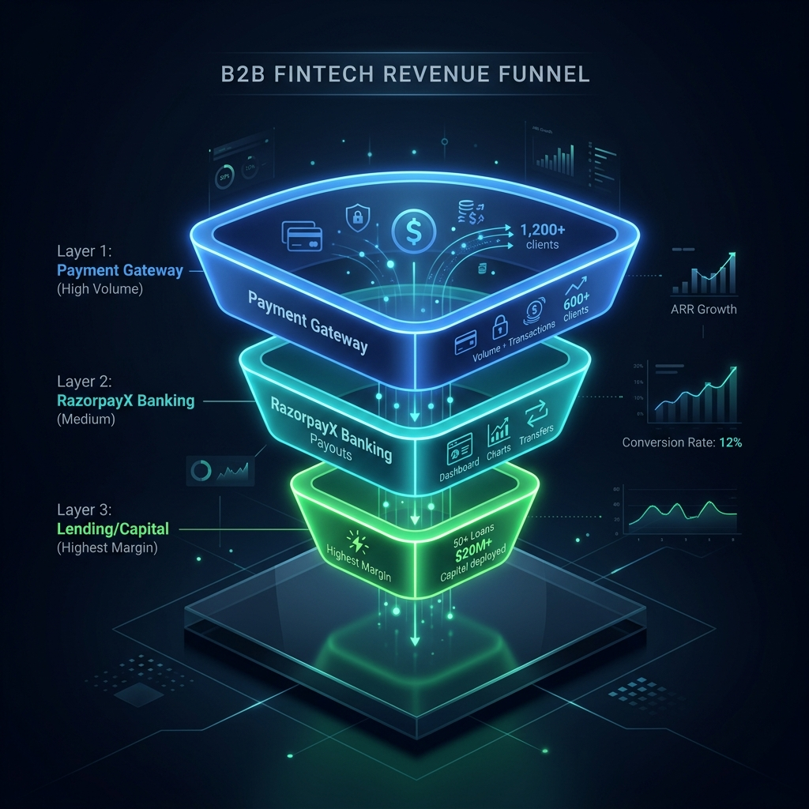

<!-- _class: cover -->
# CONSULTING STRATEGY PORTFOLIO
## Six Companies · MECE Frameworks · Unit Economics
### Ridhi Jain · BBA · IIM-A Aspirant · Independent Analyst · July 2026

---

<!-- _class: divider -->
# 01 · ZEPTO
## Situation → Complication → Resolution
### *Hook: India's youngest unicorn CEO built a $5B company by making speed a non-negotiable consumer habit. But can 10-minute delivery survive its own unit economics?*

---

<!-- _class: split -->

# Zepto's Revenue Inflection Masks a Structural CAC Problem

- **Situation:** Revenue surged from ₹2,025 Cr (FY23) → ₹4,454 Cr (FY24) → ₹7,500+ Cr (FY25 est.), a 3.7x expansion in 24 months
- **Complication:** Customer Acquisition Cost remains ₹150-300 per user on paid channels (Meta, Google). At ₹500 AOV and ~8% take rate, break-even requires **38+ orders per user per year**
- **So What?** Zepto's profitability thesis hinges not on revenue growth but on *order frequency retention* past the first 90 days

> **▸ SO WHAT?** Revenue growth without retention is just burning cash faster. The real KPI isn't GMV — it's *Month-6 cohort retention rate*. If it drops below 40%, the unit economics never converge.

---

# Zepto · MECE Revenue Decomposition

| Revenue Stream | % of Revenue | Margin | Strategic Role | Growth Vector |
|----------------|:----------:|:------:|----------------|---------------|
| **Platform Commission** | 40% | Medium | Core monetization | Linear with GMV |
| **Zepto Ads** | 35% | Very High | Profit engine | Exponential (FMCG budgets) |
| **Delivery + Handling** | 15% | Low | Cost recovery | Capped |
| **Zepto Pass** | 10% | High | Retention lock-in | Subscription flywheel |

## The "So What?" on Revenue Mix
The advertising vertical (35% of revenue at 80%+ margins) is structurally more valuable than the core delivery business. **Zepto is becoming an advertising company that delivers groceries**, not a grocery company that runs ads.

> **▸ INTERVIEWER INSIGHT:** "If Zepto's ad revenue grows to 50% of total, should they reposition their investor narrative from 'Quick Commerce' to 'Retail Media Network'?"

---

# Zepto · 2×2 Strategic Positioning Matrix

| | **High Frequency** | **Low Frequency** |
|---|---|---|
| **High AOV** | *Zepto Cafe (Food)* — ₹300 AOV, 3x/week potential. **INVEST HEAVILY.** Cross-sell into every dark store. | *Electronics on Zepto* — ₹35K AOV, 1x/quarter. **HIGH MARGIN BUT LOW VOLUME.** Use for blended EBITDA lift. |
| **Low AOV** | *Grocery Staples* — ₹180 AOV, daily habit. **DEFEND.** This is the traffic engine that feeds the ad business. | *Printouts & Utilities* — ₹100 AOV, sporadic. **DEPRIORITIZE.** Low strategic value; only useful for frequency padding. |

> **▸ SO WHAT?** Capital allocation must flow to the **top-left quadrant** (Cafe). It combines Zepto's existing dark store infrastructure with a high-frequency, high-AOV category that Blinkit cannot easily replicate through Zomato cross-sell.

---

<!-- _class: divider -->
# 02 · NYKAA
## Situation → Complication → Resolution
### *Hook: India's only profitable beauty e-commerce platform faces a pincer attack. Reliance's Tira attacks from above. Purplle attacks from below. The moat is content, not commerce.*

---

<!-- _class: split -->

# Nykaa's 42% Gross Margin Is Defensible Only If Content Creates Switching Costs

- **Situation:** 30M+ active customers, 6,000+ brands, 42-45% gross margins driven by luxury beauty curation and private labels
- **Complication:** Reliance Tira launched with unlimited capital, poaching Nykaa's premium brand partnerships. Trent's Zudio captures value-conscious consumers at the bottom
- **So What?** Nykaa's moat is not *inventory* (replicable) or *logistics* (commoditized). It is **content-driven community** — tutorials, reviews, and expert curation that drive purchase conviction

> **▸ SO WHAT?** If Nykaa loses the "trust layer" — the 200K+ reviews, video tutorials, and influencer community — its gross margins compress to marketplace-average (~15%). The content moat *is* the margin moat.

---

# Nykaa · MECE Competitive Threat Decomposition

| Threat Vector | Attacker | Severity | Nykaa's Counter | Residual Risk |
|--------------|----------|:--------:|-----------------|:-------------:|
| **Luxury Brand Poaching** | Tira (Reliance) | 🔴 Critical | Exclusive brand lock-ins, first-mover content library | High — Reliance can outbid |
| **Value Segment Erosion** | Purplle | 🟡 Medium | Nykaa private labels at competitive pricing | Medium — Price war dilutes brand |
| **Convenience Substitution** | Amazon Beauty | 🟡 Medium | Superior curation & discovery UX | Low — Amazon lacks beauty expertise |
| **Offline Expansion Pressure** | Trent/Zudio | 🟢 Low | Nykaa Luxe retail stores (100+ locations) | Low — Different customer segment |

## Strategic Recommendation (MECE)
1. **DEFEND:** Content moat — invest ₹200 Cr/year in creator partnerships and exclusive tutorial content
2. **ATTACK:** Tier 2-3 cities where Tira has zero presence but Nykaa has brand recognition
3. **EXPAND:** Private label to 25% of revenue (highest margin, fully controlled)

---

<!-- _class: divider -->
# 03 · BLINKIT
## Situation → Complication → Resolution
### *Hook: Blinkit's structural advantage isn't speed — it's that Zomato hands it 80M users for free. But does zero-CAC mask a deeper dependency risk?*

---

<!-- _class: split -->

# Blinkit's Zero-CAC Advantage Compresses Zepto's Path to Profitability by 18-24 Months

- **Situation:** ~45% quick commerce market share. Cross-sold organically from Zomato's 80M+ MAU base via the in-app "Blinkit" tab
- **Complication:** This zero-CAC pipeline means capital saved on acquisition (₹150-300/user) is reinvested into **dark store density** — creating a compounding infrastructure advantage
- **So What?** Every ₹1 Zepto spends on Google Ads, Blinkit spends on a dark store. After 24 months, Blinkit has more stores AND more users

> **▸ SO WHAT?** The CAC asymmetry is not just a cost advantage — it's a **compounding infrastructure gap**. Each quarter, Blinkit opens more dark stores with saved CAC capital, which increases coverage, which increases orders, which funds more dark stores. Zepto is fighting a flywheel.

---

# Blinkit · Unit Economics Waterfall (Per Order)

| Line Item | Amount | Cumulative | Notes |
|-----------|:------:|:----------:|-------|
| **Gross Revenue/Order** | +₹520 | ₹520 | AOV trending up via electronics |
| Platform Commission | -₹42 | ₹478 | 8% take rate |
| Dark Store Picking | -₹18 | ₹460 | Automated sorting reduces this |
| Last-Mile Delivery | -₹38 | ₹422 | Avg 1.8 km radius |
| Packaging & Handling | -₹12 | ₹410 | Standardized materials |
| **Ad Revenue Credit** | +₹45 | ₹455 | FMCG brands paying for placement |
| **Contribution Margin** | **₹455** | — | **Per order, before fixed costs** |

## The AOV Expansion Lever
| Category | AOV | Delivery Cost | Absolute Margin | *So What?* |
|----------|:---:|:------------:|:---------------:|------------|
| Grocery | ₹400 | ₹38 | Thin | Traffic engine |
| Beauty | ₹1,200 | ₹38 | Strong | Margin builder |
| Electronics | ₹35,000 | ₹40 | **Massive** | Same delivery cost, 100x margin |

---

<!-- _class: divider -->
# 04 · SWIGGY
## Situation → Complication → Resolution
### *Hook: Swiggy is fighting a two-front war. Zomato dominates food. Zepto/Blinkit dominate quick commerce. The only winning move is to make the battlefield irrelevant through bundling.*

---

<!-- _class: split -->

# Swiggy One's 3× Order Frequency Multiplier Is the Only Sustainable Competitive Advantage

- **Situation:** Post-IPO Swiggy operates three verticals — Food Delivery, Instamart (Quick Commerce), and Dineout (Dining Out)
- **Complication:** Individually, each vertical loses to a focused competitor. Zomato beats Swiggy Food. Blinkit beats Instamart. Dineout has no clear moat
- **So What?** The *bundle* wins even when each piece loses individually. Swiggy One members order 3× more frequently across all three verticals, creating a **composite LTV** that no single-vertical competitor can match

> **▸ SO WHAT?** This is the Amazon Prime playbook in India. No single Prime benefit justifies $139/year, but the *bundle* creates irrational retention. Swiggy One must become so dense with value that cancellation feels like losing 5 services at once.

---

# Swiggy · Strategic Capital Allocation Framework

| Investment Area | Current Allocation | Recommended | Rationale |
|----------------|:-----------------:|:-----------:|-----------|
| **Food Delivery Ops** | 50% | 35% | Mature market; optimize, don't expand. Defend margin. |
| **Instamart Dark Stores** | 30% | 40% | Growth engine. Must reach 1,500+ dark stores for coverage parity with Blinkit. |
| **Swiggy One Marketing** | 10% | 20% | The *only* moat. Every ₹1 here locks users into 3 verticals simultaneously. |
| **Dineout/Going Out** | 10% | 5% | High margin but low TAM. Deprioritize until core is profitable. |

## The Key Interview Question
*"If you were Swiggy's CFO post-IPO and had ₹2,000 Cr to allocate, how would you split it between defending food delivery margins (short-term EPS) versus growing Instamart (long-term TAM)?"*

> **▸ FRAMEWORK:** Use a *real options* lens. Instamart is a call option on the ₹2.5L Cr grocery market. The option premium is the current burn rate. The question is whether the implied volatility (market growth rate) justifies the premium.

---

<!-- _class: divider -->
# 05 · ZOMATO
## Situation → Complication → Resolution
### *Hook: Zomato stopped being a food delivery company in 2024. The market hasn't fully priced in the conglomerate yet. That's the alpha.*

---

<!-- _class: split -->

# Zomato's Sum-of-Parts Valuation Exceeds Its Market Cap — The Conglomerate Discount Is Mispriced

- **Situation:** Zomato operates four distinct business verticals: Food Delivery, Blinkit, Hyperpure (B2B), and District (Events/Going Out)
- **Complication:** The market prices Zomato as a food delivery company (~25x earnings). But Blinkit alone, at its growth rate, would command 8-10x revenue as a standalone entity
- **So What?** A sum-of-parts analysis reveals ₹15,000-20,000 Cr of unlocked value trapped by the conglomerate discount

> **▸ SO WHAT?** If Deepinder Goyal ever IPOs Blinkit separately, the combined entity value jumps 30-40%. This is the Reliance Jio playbook — build the asset inside, then unlock value through a separate listing.

---

# Zomato · MECE Vertical Decomposition & Margin Architecture

| Vertical | Revenue Share | YoY Growth | Margin Trajectory | Strategic Function |
|----------|:----------:|:--------:|:----------------:|-------------------|
| **Food Delivery** | 55% | +15% | ✅ Profitable | Cash cow funding all moonshots |
| **Blinkit** | 30% | +120% | 🟡 Near break-even | Primary growth engine |
| **Hyperpure** | 10% | +40% | 🔴 Low margin | B2B supply chain lock-in moat |
| **District** | 5% | +200% | ✅ 60%+ margins | Blue ocean high-margin expansion |

## 2×2 Matrix: Growth vs. Profitability by Vertical
| | **Profitable** | **Unprofitable** |
|---|---|---|
| **High Growth (>50% YoY)** | *District (Events)* — **SCALE AGGRESSIVELY.** 200% growth + 60% margins = the best unit economics in the entire portfolio. | *Blinkit* — **TOLERATE BURN.** Near break-even. The CAC flywheel is working. Give it 12 more months. |
| **Low Growth (<50% YoY)** | *Food Delivery* — **HARVEST CASH.** Optimize operations, extract maximum free cash flow to fund Blinkit and District. | *Hyperpure* — **STRATEGIC HOLD.** Low margins are acceptable because it locks restaurants into the Zomato ecosystem permanently. |

---

<!-- _class: divider -->
# 06 · RAZORPAY
## Situation → Complication → Resolution
### *Hook: India's UPI revolution killed payment gateway margins overnight. Razorpay survived by pivoting from payments company to financial operating system. The gateway is just the front door.*

---

<!-- _class: split -->

# Razorpay's Payment Gateway Generates 60% of Revenue but Only 20% of Gross Profit — The Real Business Is SaaS

- **Situation:** $7.5B valuation. Processes ₹10L+ Cr in annual payment volume. 8M+ merchants onboarded
- **Complication:** UPI's zero MDR regime commoditized payment processing. Any competitor offering 0.1% lower fees triggers merchant switching. Payments alone = race to zero
- **So What?** Razorpay's survival pivot was brilliant: use the payment gateway as a **zero-margin distribution engine** to acquire merchants, then cross-sell high-margin RazorpayX (banking) and Payroll (SaaS)

> **▸ SO WHAT?** The payment gateway is a *customer acquisition channel*, not a business model. Once a merchant integrates Gateway + RazorpayX + Payroll, switching costs become astronomical. This is the Salesforce playbook applied to Indian SMEs.

---

# Razorpay · MECE Product Ecosystem & Lock-in Analysis

| Product | Revenue Model | Gross Margin | Switching Cost | Lock-in Score |
|---------|---------------|:----------:|:--------------:|:-------------:|
| **Payment Gateway** | Transaction fee (1-3%) | 15-20% | Low (easy to switch) | ⭐⭐ |
| **RazorpayX** | SaaS subscription + payout fees | 55-65% | Medium (vendor payout workflows) | ⭐⭐⭐ |
| **Payroll** | Per-employee SaaS fee | 70-80% | Very High (salary + tax + compliance) | ⭐⭐⭐⭐⭐ |
| **Capital** | Lending interest + origination | 40-50% | High (credit line dependency) | ⭐⭐⭐⭐ |

## The Data Graph Moat (VRIO)
| Resource | V | R | I | O | Verdict |
|----------|:-:|:-:|:-:|:-:|---------|
| Payment Processing | ✅ | ❌ | ❌ | ✅ | Parity |
| Developer API Experience | ✅ | ✅ | ❌ | ✅ | Temporary Advantage |
| **Unified Cash Flow Data** | ✅ | ✅ | ✅ | ✅ | **Sustained Competitive Advantage** |

> **▸ INTERVIEWER INSIGHT:** "Razorpay sees merchant inflows (Gateway) and outflows (RazorpayX) simultaneously. This creates the most accurate real-time credit scoring model in India — better than any bank. How would you monetize this data advantage?"

---

<!-- _class: cover -->
# THANK YOU
## MECE Frameworks · Unit Economics · Strategic Recommendations
### Ridhi Jain · github.com/ridhijain709/Consulting-Strategy-Portfolio-2026
